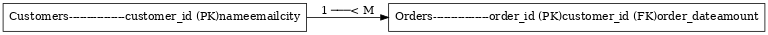

# Task 7: Creating Views  

## Objective  
Learn to create and use SQL Views for abstraction, aggregation, and security.  

## ER Diagram  
  

## Files  
- **schema.sql** → Table definitions and sample data  
- **views.sql** → View definitions (customer_orders, customer_total_spent, high_value_orders)  

## Usage  

### 1. Load Schema  

2.--Create Views
```sql
.source schema.sql;
.source views.sql;
3.Query views
-- See all orders with customer details
SELECT * FROM customer_orders;

-- Find customers who spent more than 400
SELECT * FROM customer_total_spent WHERE total_spent > 400;
Outcome

Reusable SQL logic via views

Easier queries for analysis

Controlled access for security

-- Get only high-value orders
SELECT * FROM high_value_orders;
